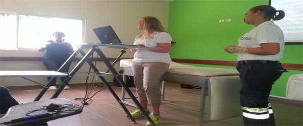
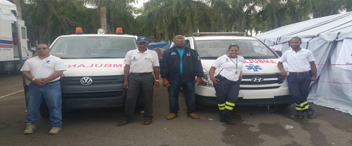
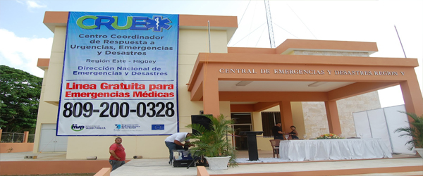
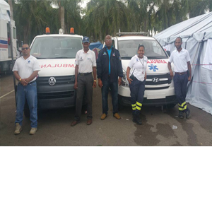

<!DOCTYPE html>
<html>
<head>
<title>CRUED</title>
<link rel="stylesheet" type="text/css" href="estilo de portada.css">
<link rel="stylesheet" type="text/css" href="fonts.css">	
<link rel="icon" type="text/css" href="">
</head>
<body>

<header>
	<nav>
		<ul>
			<li><a href="#"><i class="icon icon-home3"></i>Portada</a></li>
			<li><a href="#"><i class="icon icon-folder-open"></i>Servicios</a>
				<ul>
				<li><a href="#"><i class="icon "></i>Itema1</a></li>
				<li><a href="#"><i class="icon"></i>Itema2</a></li>
				<li><a href="#"><i class="icon"></i>Itema3</a></li>
				</ul></li>
			<li><a href="#"><i class="icon icon-phone"></i>Contacto</a></li>
			<li><a href="#"><i class="icon icon-profile"></i>Nosotros</a></li>
		</ul>
	</nav>
</header>

	<ul>
		<li></li>
		<li></li>
		<li></li>
		<li></li>
	</ul>

	
<a href="file:///C:/Users/Acer%20Aspire%205733Z/Desktop/salud%20publica/contenido1.html"><table class="texto1"><tr><td> <b>   El CRUEM este realizo una movilizacion   para la cobertua del Opertivo viergen de   la Altagracia 2018.</td></tr></table></a>

<a href="file:///C:/Users/Acer%20Aspire%205733Z/Desktop/salud%20publica/contenido1.html"><table class="texto2"><tr><td> <b>   Descues de su inaguracion el CRUEM  a dado miles de servicos a favor de la  comunidades de la region este del pais.</td></tr></table></a>

<a href="file:///C:/Users/Acer%20Aspire%205733Z/Desktop/salud%20publica/contenido1.html"><table class="text3"><tr><td> <b>   El Misnisterio de Salud Publica agrega a   su flota de vehiculos en servicio nuevas   unidades de primera atencion. </td></tr></table></a>

</body>
</html>
